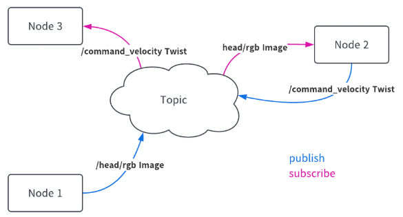

# ROSとは

ROS(Robot Operating System)は、ロボットソフトウェアの開発を助けるためのフレームワーク。

WindowsやmacOSといった一般的なOSとは異なり、ROSはロボットシステムのような分散システムのための通信ミドルウェアという役割を担っています。

## 詳細

一般的にロボットはセンサやアクチュエータといった様々なデバイスから構成されています。それらのデバイスを制御するためにロボット内で複数のコンピュータが起動し、複数のプロセスが実行されます。

## 背景

ロボット全体の制御のため、各プロセス間で通信が必要となる。

例えばA社のアクチュエータを使用していたのをB社のアクチュエータに変更するとなった際に通信プロトコルが変更されてしまうと、デバイス変更の度に通信まわりのコード変更が必要になってしまいます。

このような異なるデバイスによる通信まわりの変更の手間を無くすために、**ROSでは共通の通信プロトコルを予め定めることで、容易にモジュールの入れ替えや再利用が可能となっています。**

## 特徴

* **モジュール性** : **ROSは「ノード」と呼ばれる小さなプログラムの集合体で構成されており、各ノードが特定のタスクを担当します。**ノード同士は共通化された通信システムによって容易に接続することができ、これにより、各プログラムをモジュールとして開発を進めることができます。
* **多言語対応** : ROSはC++やPythonなど、複数のプログラミング言語をサポートしています。
* **強力なコミュニティ** : **ROSはOSSであり、世界中の研究者や開発者によって作られています。**各モジュールがウェブ上で共有化されたエコシステムがあり、開発者は必要なモジュールをインストールして使用することができます。また情報共有のためのコミュニティやカンファレンスといった活動が活発に行われており、誰でもコミュニティに参加し、ROSの機能の提案や開発に加わることができます。

## ユースケース

* **自動運転車** : 多くの自動運転車のプロトタイプでは、ROSがセンサーの統合、データの処理、ナビゲーションのために使われています。特に、LIDARやカメラ、GPSなどの異なるセンサーからの情報を同時に処理する能力は、自動運転車の開発において非常に価値があります。
* **サービスロボット** : 病院、ホテル、レストランなどのサービス産業でのタスクをサポートするロボットもROSを活用しています。これにより、物の運搬や環境認識、人との対話などの複雑なタスクを効率的に実現できます。
* **研究と学術** : 多くの大学や研究機関では、新しいロボティクス技術やアルゴリズムの開発・評価にROSが用いられています。そのモジュール性と拡張性により、研究者は自身の研究に特化した機能を迅速に開発できます。
* **産業ロボット** : 工場の生産ラインや倉庫でのロジスティクスなど、産業分野でのロボットもROSの恩恵を受けています。特に、ROS-Industrialというプロジェクトは、産業環境でのROSの適用を推進しています。
* **家庭用ロボット** : 掃除ロボットやペットケアロボットなど、家庭での使用を目的としたロボットの開発にもROSが採用さ

## ROS1 VS ROS2

ROSにはROS1とROS2という2つのバージョンが存在します。**ROS2はROS1をさらに進化させた以下の特徴を持っています。**

* **リアルタイム対応** : ROS2はリアルタイムシステムでの動作に焦点を当てて開発されており、より高いパフォーマンス要件を持つアプリケーションに適しています。
* **クロスプラットフォーム** : ROS2はWindows、macOS、そしてLinuxでの動作がサポートされており、開発の幅を広げています。
* **セキュリティの強化** : ROS2はセキュリティを初めから考慮して設計されており、ノード間の通信を暗号化することやアクセス制御を導入することが可能です。

### ROS2が必要になった背景

ROSがそのように成功を収めてきたのなら、なぜROS2が必要になったのでしょうか。

ROSは、もともと、研究用ロボットアプリケーションのラピッドプロトタイピング用ツールとして設計されました。Willow Garage社がPR2ロボットを開発する環境としてスタートしています。PR2を使用した研究開発の促進を目的としていましたが、他のロボットでもソフトウェアを再利用できるようにするために、抽象化のレベルを定義することに注力しました。

しかし、ROSが認められて普及し、用途が拡大していくと、想定していなかったようなユースケースが発生します。

２足歩行するヒューマノイド、タジク産業用アーム、ドローン

結果、ROSでカバーできなくなった部分をROS２で開発するということで開発された。

ROSとROS2の相互運用はブリッジプログラムで対応している。

|                                       | **ROS**                                                                   | **ROS2**                                                                                                               |
| ------------------------------------- | ------------------------------------------------------------------------------- | ---------------------------------------------------------------------------------------------------------------------------- |
| プラットフォーム                      | Ubuntu``※DistributionによってはmacOS、Windows10、他Linux                       | Ubuntu、macOS、Windows                                                                                                       |
| 通信                                  | XMLRPC + TCPROS``※独自開発の通信ライブラリ                                     | DDS（Data Distribution Service）``※OMGにより標準化された通信MW仕様                                                          |
| プログラミング``言語                  | 言語ごとにスクラッチで開発されたクライアントライブラリ（roscpp、rospy、…）     | C言語ベースの共通基盤（rcl）の上に各言語用のクライアントライブラリを実装（rclcpp、rclpy、…）                                |
| ビルドシステム                        | rosbuild、catkin                                                                | ament、colcon（catkin/amentを呼び分け）                                                                                      |
| IDL（Interface Description Language） | ROS IDL``*.msg/*.srv                                                          | ROS IDLをDDS/CORBA IDLに変換``*.msg/*.srv → *.msg.idl、*.srv.idl                                                        |
| Launchシステム                        | XML                                                                             | Python``⇒条件分岐などのより複雑なロジックを記述可能                                                                         |
| 複数ノード対応                        | 1ノードを1プロセスで実行                                                        | 複数ノードを1プロセスで実行可能                                                                                              |
| リアルタイム性                        | 通信がTCPであるためメッセージ送信の制御ループに関してリアルタイム性の保証が困難 | 通信がUDPであるためメッセージ送信をリアルタイム周期で行うことが可能``※他OSやHWのリアルタイム性確保が必要                    |
| 計算グラフ                            | 起動時のみノードとトピックのマッピングが可能                                    | ノード起動時だけでなく実行途中でノードとトピックを再マッピングすることが可能                                                 |
| 組込みシステム``対応                  | 組込みボードとシリアル通信（rosserial（UART））                                 | ファームウェアに直接ノードを実装可能``※ROSの通信ライブラリのみを使って、組込みボードに直接ROSプログラミングを行うことが可能 |
| ネームサービス                        | ノード間の接続のためのネームサービスをマスタで実行``※マスタが単一障害点        | DDSミドルウェアを介して直接通信先を検索してノード間を接続                                                                    |

## 基本機能

* メッセージ通信
  * プロセス間、コンピュータ間の通信ライブラリが提供されています。
* デバイスドライバ
  * ROSに対応しているセンサやアクチュエータを搭載したロボットであれば、違うロボットであってもほぼ同じソースコードを使用して動かすことができます。
    roombaを動かすために書いたソースコードをそのまま使用してHSRを動かす、といったことができます。
  * [https://github.com/ros-drivers](https://github.com/ros-drivers)
  * [http://wiki.ros.org/Sensors](http://wiki.ros.org/Sensors)
* ライブラリ
  * ロボットを動作させるソフトウェア(ナビゲーション、マニピュレーション)の基本機能の大半が提供されています。
* 視覚化ツール
  * ロボットの内部状態やセンサ出力を2次元、3次元で視覚化するRvizや3次元動力学シミュレータのGazeboなどが提供されています。
* パッケージ管理
  * 多種多様なプログラミング言語(python, C++, …)、依存関係で記述されたプログラム同士を統合的に使用することが可能です。
  * これにより、経路計画など処理が重いプロセスはC++でコードを書き、画像認識など機械学習系のプロセスはpythonでコードを書く、といったこともできるようになります。

## ROSのメッセージ通信

ロボットを動作させる際には多くのプログラムを並列で実行して、それぞれがデータをやり取りする必要がある。

ROSはプログラム間の通信に必要な機能を提供してる。

### ノード

ROSではプログラムの単位をノードと呼ぶ。

基本的に一つのファイルが一つのノードとなる。

ノードにはtopic、service、actionlibなどの通信方法を使って、他のノードとデータのやり取りを行います。

### トピック

* ROSでの、最も基本的なデータ通信の経路を「トピック(topic)」と呼びます。
* ノードはメッセージをトピックへ向けて配信(Publish)し、また購読する(Subscribe)ことで他のノードと情報を共有することができます。
* 配信を行うノードをPublisher、購読を行うノードをSubscriberと呼びます。ノードはこのどちらかに二分することができるというわけではなく、一つのノードがpublisherであり、subscriberでもあるという状況がほとんどです。
  * メッセージ
    トピックへ配信したり購読したりするときのROSデータ型をメッセージと呼ぶ。メッセージの型はmsgファイルに記述されている。

* ROSマスタ(ROS master)
  * 「ROSマスタ(ROS master)」は、ノード、トピックの名前登録を行い、それぞれのノードが他のノードから見えるようにする役割を担っています。
  * 通信するノード名とトピック名およびサービス名の対応が決定した後、ノード同士が「peer-to-peer」で通信します。
  * ROSマスタを起動するには「roscore」というコマンドを実行します（が、ロボットによっては起動時にこのコマンドが自動で実行されることが多いため、あまり意識する機会はないかもしれません）。

### ROSと連動するソフトウェア

ROSは以下のようなソフトウェアと連動して使うためのパッケージを提供しています。簡単な説明にとどめるので、詳しい使い方は必要になった際に調べてください。

* OpenCV
  豊富な機能を持つ2D画像処理用のライブラリです。 カメラで撮影した画像を処理する際に使用します。
* PCL(Point Cloud Library)
  * 3次元点群処理のライブラリ。
  * HSRやRoombaにはRGBDカメラが搭載されています。DはDepthという意味で、画像の各ピクセルに距離情報を対応させたDepth画像を取得することができます。
    このような三次元の点群の情報を処理する際にPCLを使うと便利です。
* OpenSLAM
  * 地図を効果的に使うことで、より安定したロボットのナビゲーションを行うことができます。
  * 移動ロボットの自己位置推定と地図生成を同時に行うSLAM(Simultaneous Localization and Mapping)という手法は、それだけで一つの研究分野になる程奥深い分野で、活発に研究が行われています。
  * OpenSLAMは、SLAMのソースコードを公開するためのプラットフォームを提供しており、様々なSLAMの手法を実装しています。
