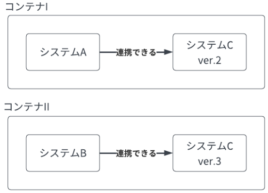
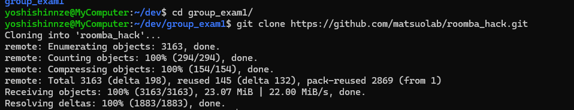
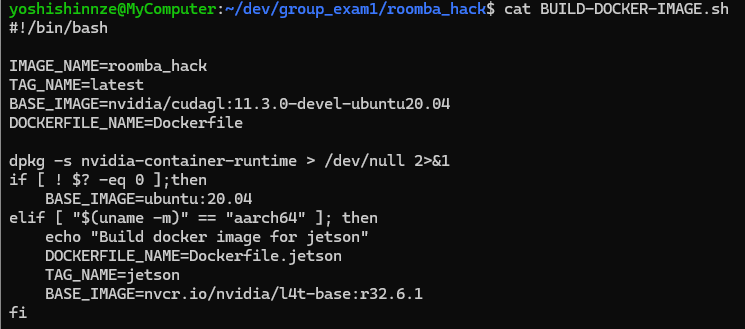
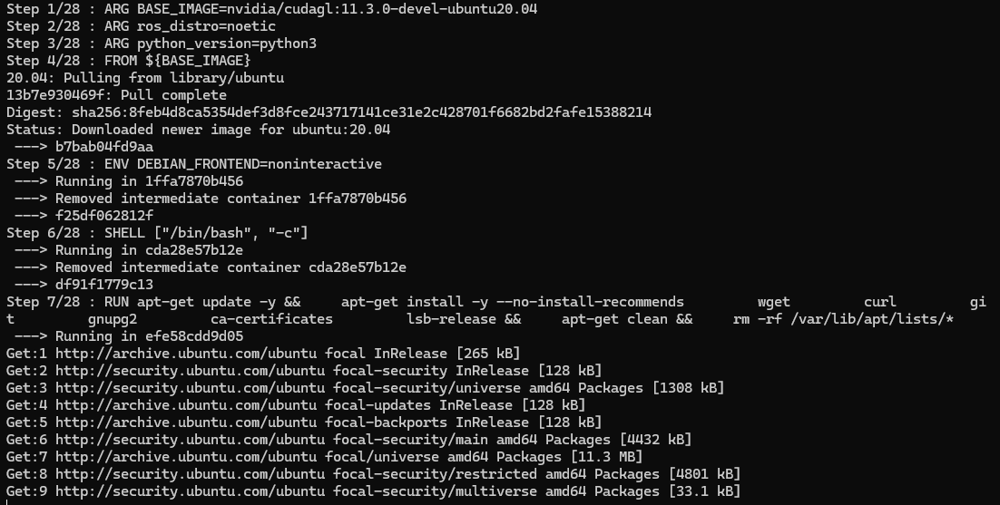

# 目的

ROSの開発環境構築を行う。

## 環境説明

### Linux

ROSはLinuxで動作することを想定しているため、ROSを使うためには、ある程度Linuxの知識が必要となる。

特にLinuxコマンドについては知っておくと理解しやすくなる。

```cmd
"""
ここではLinuxのコマンドを十分に説明できないので、コマンドの例を挙げることに留めます。
詳しいサイトに沿って自分で使いながら覚えていくことをお勧めします。
"""

# カレントディレクトリ(自分が今いるディレクトリ)を確認
pwd

# ディレクトリ内のファイル・ディレクトリの表示
ls

# カレントディレクトリを変更
cd <DirectoryName>

# ディレクトリ作成
mkdir <NewDirectoryName>

# ディレクトリ削除
rmdir <DirectoryName>

# ファイル作成
touch <NewFileName>

# ファイル消去
rm <FileName>

# ファイルの内容を表示
cat <FileName>
```

Docker

Dockerとはデータやプログラムを隔離できる仕組み

例

コンピュータの中でシステムAとシステムBを動かしたいとします。そして、これらは他のシステムCに依存しているものとします。
もし、AがCのver.2にのみ対応していて、BはCのver.3にのみ対応していた場合、Bを実行できるようにCをver.3にしてしまうと、Aが実行できなくなってしまいます。

解決法

* コンテナIの中にはプログラムAとCのバージョン2をインストールして使い、
* コンテナIIの中にはプログラムBとCのバージョン3をインストールして使用する



dockerコンテナの中はPC本体の環境からは隔離されているため、安全に開発することが出来る。

## 演習





### Error

Cannot connect to the Docker daemon at unix:///var/run/docker.sock. Is the docker daemon running?

```
To resolve the "Cannot connect to the Docker daemon at unix:///var/run/docker.sock" error, you can follow these troubleshooting steps:
Check if the Docker daemon is running: Use the command sudo service docker start or systemctl start docker to start the Docker service if it is not running. 
2
Restart the Docker service: If the daemon is running but you still encounter the error, try restarting it with sudo service docker restart. 
1
Check disk space: Ensure that there is enough disk space available, as insufficient resources can prevent the Docker daemon from starting. 
1
Verify Docker installation: Make sure Docker is properly installed and configured on your system. 
2

Following these steps should help you resolve the issue.
```

```


Resolving the "docker: unrecognized service" Error

shell - docker: unrecognized service - Stack Overflow
https://stackoverflow.com/questions/63012885/docker-unrecognized-service
"Docker: unrecognized service" error - How to resolve
https://bobcares.com/blog/docker-unrecognized-service-error/
[Solved] Docker service fail to start after update - General - Docker …
https://forums.docker.com/t/solved-docker-service-fail-to-start-after-update/134444
The error docker: unrecognized service typically occurs when trying to start the Docker service using the service command. This issue can arise due to various reasons, such as incorrect installation or configuration of Docker.

Example

$ service docker start
docker: unrecognized service
Common Causes and Solutions

1. Using Systemd Instead of Service Command

On modern Linux distributions, Docker is managed by systemd rather than the service command.

Example:

$ sudo systemctl start docker
This command starts the Docker service using systemd.

2. Incorrect Installation of Docker

If Docker is not installed correctly, you may encounter this error. Reinstalling Docker can resolve the issue.

Example:

$ sudo apt-get remove docker docker-engine docker.io containerd runc
$ sudo apt-get update
$ sudo apt-get install docker-ce docker-ce-cli containerd.io
This sequence of commands removes any existing Docker installations and installs Docker correctly.

3. Using WSL (Windows Subsystem for Linux)

If you are using WSL, ensure that Docker is properly configured for WSL.

Example:

$ sudo dockerd
This command starts the Docker daemon manually in WSL
2
.

By following these steps, you can resolve the docker: unrecognized service error and successfully start the Docker service.
```

## インストール





### reference

[開発環境 | ロボットシステム入門](https://matsuolab.github.io/roomba_hack_course/course/chap1/%E9%96%8B%E7%99%BA%E7%92%B0%E5%A2%83/)
