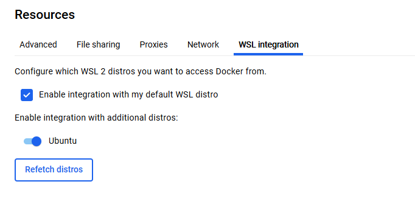
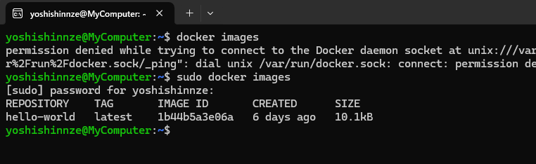

Docker設定

歯車マークでUbuntuのスイッチを入れる。




```
Cannot connect to the Docker daemon at unix:///var/run/docker.sock. Is the docker daemon running
```

対策

```
sudo update-alternatives --set iptables /usr/sbin/iptables-legacy
sudo update-alternatives --set ip6tables /usr/sbin/ip6tables-legacy
sudo service docker restart
```



