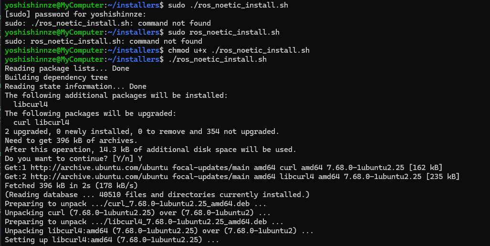
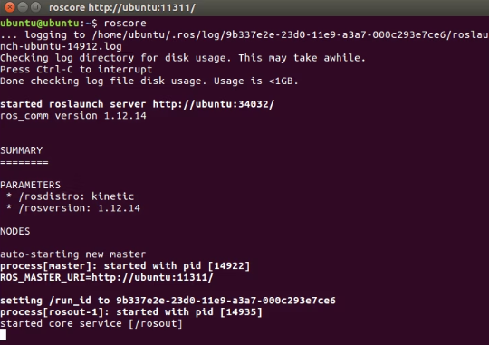
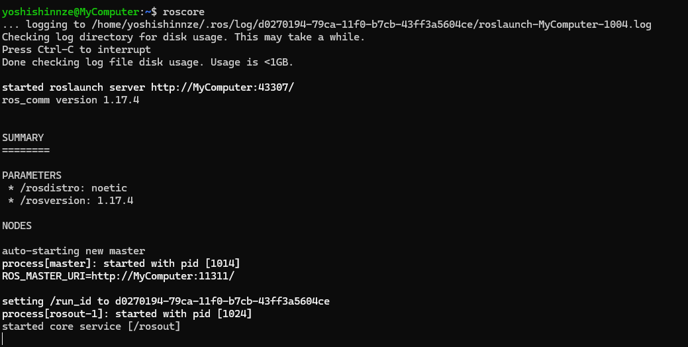

```shell
# !/bin/sh

sudo sh -c 'echo "deb http://packages.ros.org/ros/ubuntu $(lsb_release -sc) main" > /etc/apt/sources.list.d/ros-latest.list'
sudo apt install curl # if you haven't already installed curl
curl -s https://raw.githubusercontent.com/ros/rosdistro/master/ros.asc | sudo apt-key add -

sudo apt update
sudo apt install ros-noetic-desktop-full
apt search ros-noetic

sudo apt-get install python-rosdep
sudo rosdep init
rosdep update

echo "source /opt/ros/noetic/setup.bash" >> ~/.bashrc
source ~/.bashrc
source /opt/ros/noetic/setup.bash

sudo apt-get -y install python-rosinstall
sudo apt-get install -y python3-catkin-tools

```


shを実行するときは以下によりファイルの権限を変更しておくこと

```shell
$ chmod u+x ./Linux/20231017_shell_exec.sh
```


操作に関しては以下の通り


## リポジトリの登録

ROSはUbuntuの標準のaptリポジトリにはないのでROSのリポジトリを登録します。1行目がリポジトリの登録、2行目が鍵の登録です。


## インストール

ここがインストールの本体です。rosのインストールには3種類のオプションがあります。今回はdesktop-fullを使用します。


| パッケージ名            | 入っているもの                      |
| ----------------------- | ----------------------------------- |
| ros-indigo-ros-base     | 通信、ビルド等                      |
| ros-indigo-desktop      | Base＋rqt,rviz,一般的なライブラリ等 |
| ros-indigo-desktop-full | desktop＋シミュレーター等           |


## rosdepのインストール

```shell
sudo rosdep init
rosdep update

```


## bashrcの設定

```shell
echo "source /opt/ros/kinetic/setup.bash" >> ~/.bashrc
source ~/.bashrc
source /opt/ros/kinetic/setup.bash

```

これよりも上の設定でROSはPCにインストールされますが、標準ではROSのコマンドにパスは通っていません。そこで毎回ターミナルの起動時にROSコマンドへのパスを通す必要があります。~/.bashrcはターミナルの起動時に毎回実行されるスクリプトです。


# インストールの確認

```shell
roscore

```

上記コマンドで以下が表示されればOK



同じものでました！




# パッケージの作成

```shell
cd ~/catkin_ws/src
catkin_create_pkg rospackage_test roscpp rospy std_msgs tf 

```


ROSのプログラムはROSパッケージという単位で管理されます。パッケージの作成はインストールとは関係ありませんがここで説明します。パッケージは必ずcatkinワークスペースの中のsrcディレクトリの内部に置きます。
パッケージを製作するコマンドが `catkin_create_pkg`です。1つ目の引数はパッケージ名（名前は自由、上のスクリプトではbeginner_tutorials）2つ目以降は依存するパッケージです。とりあえず上の4つを入れておけば簡単なプログラムを作れます。この依存は後から追加できます。


# よく使うROSパッケージのインストール

```shell
sudo apt-get install -y ros-kinetic-joystick-drivers
sudo apt-get install -y ros-kinetic-jsk-visualization
sudo apt-get install -y ros-kinetic-image-proc

```

よく使うものをここであらかじめインストールしておきます。
ros-[ROSのディストリビューション]-[パッケージ名(_（アンダーバー）を-（ハイフン）に変えたもの)]がaptのパッケージ名になっています。
例えば[joystick_drivers](http://wiki.ros.org/joystick_drivers?distro=lunar)をインストールしたければros-kinetic-joystick-driversという名前のaptパッケージをインストールします。


## reference

[ROS講座02 インストール #ロボット - Qiita](https://qiita.com/srs/items/e0e0a9dc3f94c2d3348e)
