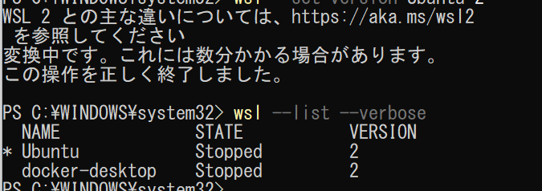

WSL1 が入っている状態から WSL2 にアップグレードする場合は、

**Linuxカーネル更新 → ディストリビューションのバージョン切り替え** の2ステップで進めます。

以下、Windows 10 / 11 両方に対応した手順です。

---

## **1. WSLのバージョン確認**

PowerShell（管理者権限なしでOK）で：

```powershell
wsl --list --verbose
```

例：

```
  NAME      STATE   VERSION
* Ubuntu    Stopped 1
```

`VERSION`が `1` になっていればWSL1です。

---

## **2. WSL2の要件確認**

* Windows 10 バージョン 2004 以降（Build 19041以上）または Windows 11
* BIOSで仮想化機能（Intel VT-x / AMD-V）が有効になっていること

  （無効だとエラーが出ます）

---

## **3. 必要な機能を有効化**

PowerShell（ **管理者権限** ）で：

```powershell
dism.exe /online /enable-feature /featurename:Microsoft-Windows-Subsystem-Linux /all /norestart
dism.exe /online /enable-feature /featurename:VirtualMachinePlatform /all /norestart
```

完了したらPCを再起動します。

---

## **4. Linuxカーネル更新プログラムのインストール**

* Microsoft公式の「WSL2 Linux カーネル更新プログラム」をダウンロード＆インストール

  [ダウンロードリンク（Microsoft公式）](https://aka.ms/wsl2kernel)

---

## **5. デフォルトをWSL2に設定**

再びPowerShell（管理者権限なしでOK）で：

```powershell
wsl --set-default-version 2
```

これで今後インストールする新しいディストリビューションは自動的にWSL2になります。

---

## **6. 既存のUbuntuをWSL2に変換**

```powershell
wsl --set-version Ubuntu 2
```

※ `Ubuntu` の部分は `wsl --list` で確認できるディストリ名に合わせてください。

変換には数分かかります。

---

## **7. 確認**

```powershell
wsl --list --verbose
```

`VERSION` が `2` になっていればOKです。

---

## **8. 推奨アップデート**

最新のWSLに更新しておくとバグが減ります：

```powershell
wsl --update
```

---

この手順で既存のWSL1をWSL2に切り替えられます。

もしこのあと **WSL2上のUbuntuでDockerを動かす** 予定なら、Docker Desktopを入れてWSL統合を有効化すればすぐ使えますし、軽量化したいならUbuntu内に直接Docker Engineを入れる方法もあります。

---

必要なら、この流れの**図解付きチートシート**も作れますが、作りますか？

そうすると1ページで手順を見返せるようになります。



